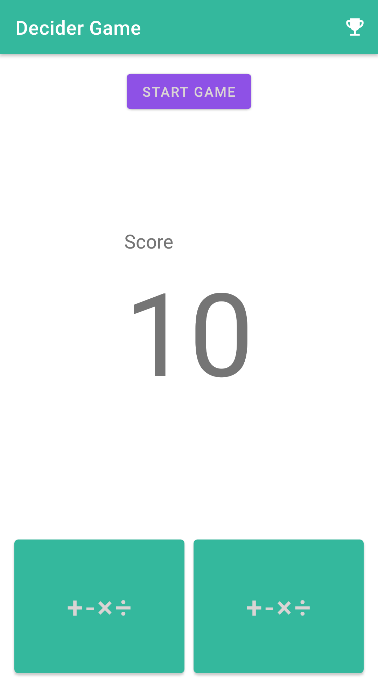
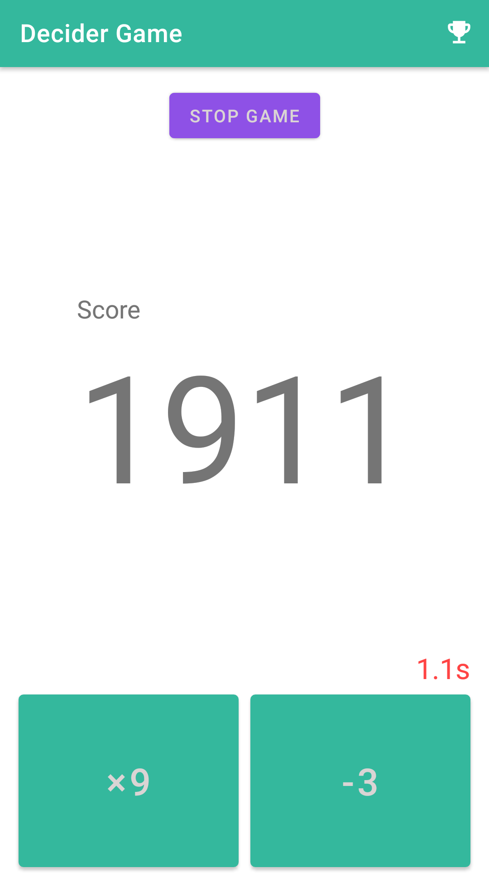
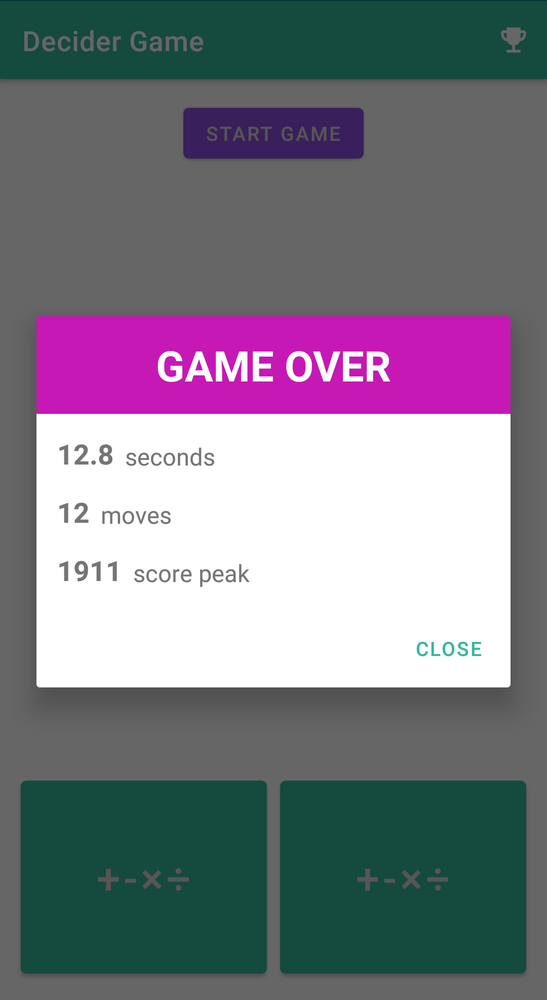
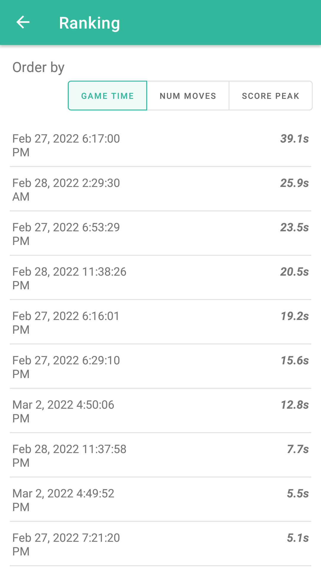

# Decider Game

### Basic Mathematics game based in choosing the right operation between two choices.

### The player needs to keep the score between **1** and **2500** and has 3 seconds to complete the move (3.5 seconds in the first move).

### 3 types of game results are recorded:

* Game time
* Number of moves
* Score peak

### It is possible to see the Top 10 ranking for each type of game result

## Screenshots

